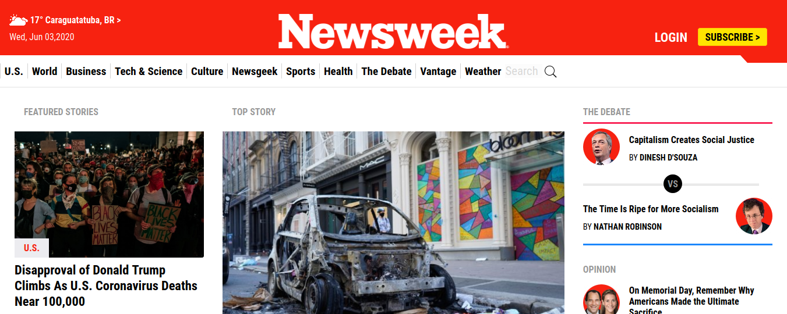

# Newsweek.com Clone - Responsive Bootstrap 4 Website

> In this project, I explored the Bootstrap 4 tools to build a newsweek.com clone.
> Bootstrap Grid Layout and pre-defined CSS Classes were applied to achieve this goal.
> Also this project was used to improve classes organization and the application and understanding of alternative classes structuring (inspired by both OOCS and BEM classes naming methods)



This project covers the following HTML and CSS3 concepts:

- Responsiveness
- Web Layout
- Mobile and other small screen sizes needs
- Media Queries
- Bootstrap 4

## Built With

- HTML
- CSS
- Google fonts
- Bootstrap 4

## Live Demo

[Live Demo Link]()

## Getting Started

To get a local copy of the repository please run the following commands on your terminal:

```
$ cd <folder>
```

```
$ git clone https://github.com/ldelbel/Newsweek-Clone/
```

## Author

👤 **Lucas Delbel**

- Github: [@ldelbel](https://github.com/ldelbel)
- Twitter: [@delbel_lucas](https://twitter.com/delbel_lucas)
- Linkedin: [lucasdelbel](https://www.linkedin.com/in/lucasdelbel/)

## 🤝 Contributing

Contributions, issues and feature requests are welcome!

Feel free to check the [issues page](https://github.com/ldelbel/Newsweek-Clone/issues).

## Show your support

Give a ⭐️ if you like this project!

## Acknowledgments

- Project originally taken from The Odin Project
- Project inspired by Microverse Program
